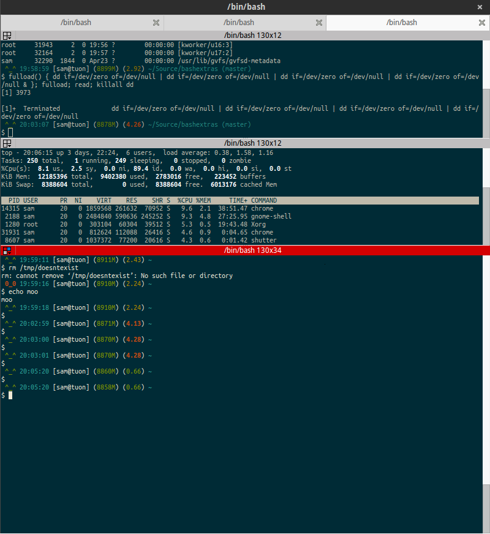

# bashextras

Anything you might wanna do to the bash prompt (or any other Linux commandline application that keeps it's config in ~/.something) can go in here. As is, it sets up a fancy PS1 with indicators for memory usage, CPU load, pwd, git repo status (current branch mainly) and $?.

## Installation

Clone this repo down anywhere (perhaps someplace only you or root can write to?) and add `source /path/to/bashextras` to ~/.bashrc.

## Known Issues

 - The whole thing is very Debian/Ubuntu centric. YMMV.
 - The whole thing was cobbled together from internet sources and general hackery with no eye to future maintainability. YMMV.
 - The colour scheme works well under [Solarized](http://ethanschoonover.com/solarized). YMMV.
 - I rearranged things a bit to make this repo and didn't test it after. ;) YMMV.

## Thanks

There are a whole host of people who contributed to this indirectly, usually via blog posts, but I never kept track of them. If you recognize a bit of a code or know of the originator of an idea that's used here, please let me know.
